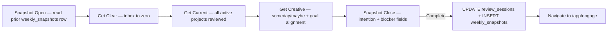

# Architecture Spine — Archer

## Paradigm

**Single-layout Next.js App Router application with Node.js runtime, Supabase backend, and email/password auth. All features require authentication. All generation saves to Supabase automatically.**

There is no unauthenticated surface. Visitors who are not signed in land on `/sign-in` and cannot access any feature until authenticated. All AI generation — both Project Mode (single-shot) and Goal Mode (wizard) — requires a signed-in account and persists output directly to Supabase on completion. There are no copy or download actions anywhere in the product.

The experimental vault is an independent client-side layer (AES-GCM + PBKDF2, `localStorage`) that coexists with Supabase but is never merged into it and operates outside the auth boundary.

---

## Decisions

### AD-5: Tailwind CSS v4, No Component Library [ADOPTED]

- **Binds:** All styling via Tailwind utility classes (v4); design tokens from `DESIGN.md` encoded as Tailwind CSS-first `@theme` tokens in `globals.css`
- **Prevents:** CSS-in-JS, external UI kits (shadcn, Radix, MUI), downgrading to v3, `tailwind.config.ts` token approach
- **Rule:** Custom components only, in `components/`. All design tokens live in `globals.css` under `@theme`.

### AD-7: Next.js App Router, Node.js Runtime, `output: 'standalone'` [ADOPTED]

- **Binds:** `output: 'standalone'` in `next.config.ts`; API routes under `app/api/`; full App Router with auth-gated `/app/*` shell; Next.js middleware enforces auth on all `/app/*` routes
- **Prevents:** `output: 'export'` (static), edge runtime, serverless functions
- **Rule:** `/api/generate` and all future route handlers require Node.js runtime. Confirmed by current codebase.

### AD-8: Single Authenticated Layout [ADOPTED]

- **Binds:** All routes under `/app/*` render the authenticated shell (fixed 240px sidebar + max 720px main). `/sign-in`, `/sign-up`, `/forgot-password` render a minimal centred single-column layout (max 480px, no sidebar). There are no other layout modes — no unauthenticated landing page, no public-facing surfaces.
- **Prevents:** Unauthenticated access to any feature; a two-layout system; sidebar on sign-in pages
- **Rule:** Unauthenticated requests to any `/app/*` route are redirected to `/sign-in` by Next.js middleware. The root `/` redirects to `/app/engage` if authenticated, `/sign-in` if not.

### AD-9: Goal → Project → Action Hierarchy [ADOPTED]

- **Binds:** The three-level hierarchy is enforced by the data model. An action must have a parent project; a project must have a parent goal. Supabase FK constraints encode this. UI navigation mirrors it at every level.
- **Prevents:** Standalone action creation without a project; project creation without a goal (Project Mode creates a project linked to the signed-in user but not to a goal — this is the one permitted exception, explicitly modelled in the schema); flat task-list behaviour
- **Rule:** The Engage view shows committed actions only — never the raw action list. The weekly review surfaces projects, not actions directly.
- Project Mode may create a manual project without AI. A selected `goal_id` must belong to the signed-in user; a project has at most one parent goal and may be unlinked.

### AD-10: Single Committed Next Action Per Project [ADOPTED]

- **Binds:** At most one action per project may be in `committed` status at a time. Committing a new action automatically decommits the prior one. A project that is `Active` with zero committed actions is `stuck`.
- **Prevents:** Multiple committed actions per project; implicit task-queue behaviour; stuck projects being silently hidden
- **Rule:** Commit logic enforced at the database layer via a Supabase function/trigger (see Schema — `fn_commit_action`), not only in the UI. Stuck projects surface with an amber indicator everywhere they appear — there is no quiet render path for a stuck Active project.

### AD-11: AI Generation Contract — Single Endpoint, Discriminated Request [ADOPTED]

- **Binds:** A single Next.js route handler (`app/api/generate/route.ts`) serves all AI generation. Auth is checked on every call — unauthenticated requests rejected with 401. The request body is a discriminated union on `mode` (and `step` for goal mode):
  - **Pattern A** (Project Mode): `POST { mode: 'project', input }` → markdown string → saved to Supabase `projects` row
  - **Pattern B** (Wizard Step 1): `POST { mode: 'goal', step: 'framework', goal }` → skill framework JSON (no DB write — returned to client for the wizard to hold in transient state)
  - **Pattern C** (Wizard Step 4): `POST { mode: 'goal', step: 'generate', goal, framework, ratings, drivers, barriers, ifThen }` → full breakdown markdown → saved to Supabase `goals` + `projects` + `actions` rows
  - Provider selected by `AI_PROVIDER` env var (`gemini` | `groq` | `openai`). Default: `gemini` (`gemini-3.1-flash-lite`). 30s timeout on all calls. No streaming.
- **Prevents:** Client-side AI calls; unauthenticated generation; copy/download as an output path; hardcoded models; multiple endpoints duplicating auth/provider/timeout plumbing
- **Rule:** One endpoint, one auth check, one provider-selection path, one timeout handler. The three patterns differ only in which system prompt they load and what they return. Pattern B is the only one that does not write to Supabase — it returns the framework for the wizard to hold in memory (per AD-15). Patterns A and C write to Supabase before returning; the client receives the row ID and navigates to the saved resource. There is no "show output then save" flow.

### AD-12: AI Invariant — User Owns All Self-Assessment Data [ADOPTED]

- **Binds:** AI proposes required levels (target profile) and generates the breakdown from structured user inputs. AI never infers, pre-fills, or suggests the user's current ratings, drivers, barriers, or if-then plan content.
- **Prevents:** Any pre-fill of gap slider values; AI-suggested drivers or barriers; AI-inferred if-then plan
- **Rule:** Wizard Steps 2–3 receive zero AI input. All sliders start at 5 (neutral midpoint). All Step 3 fields start blank. Any component that appears to pre-fill user-owned data is a design failure.

### AD-13: Auth — Supabase Auth, Email + Password, Middleware-Enforced [ADOPTED]

- **Binds:** Supabase Auth with email + password only. No OAuth providers in v1. Next.js middleware checks auth on all `/app/*` routes and redirects unauthenticated requests to `/sign-in`. Password reset via Supabase Auth email flow.
- **Prevents:** Unauthenticated access to any feature; magic link auth; OAuth (Google, GitHub, etc.) in v1
- **Rule:** Supabase client initialised in `app/app/layout.tsx` (authenticated shell). `lib/supabase/server.ts` used in route handlers. `lib/supabase/client.ts` used in client components. Middleware reads session from Supabase cookie.

### AD-14: Supabase Schema — Tables, Relationships, RLS [ADOPTED]

- **Binds:** Six core tables (full DDL in Schema section below). FK constraints enforce the Goal → Project → Action hierarchy. Row-level security (RLS) on all tables — users read/write only their own rows. All tables carry `user_id uuid references auth.users(id) on delete cascade`.
- **Prevents:** Cross-user data leakage; clientside-only data model for authenticated data; tables without RLS
- **Rule:** No table is created without RLS enabled and a `user_id` policy. Schema DDL is the authoritative definition — TypeScript types in `lib/supabase/schema.ts` are generated from it.

### AD-15: Wizard State — Client-Only, Not Persisted Until Generation Succeeds [ADOPTED]

- **Binds:** Multi-step wizard state (goal text, framework items, ratings, drivers/barriers/if-then) lives in React component state for the wizard session only. State is written to Supabase only on successful Step 4 generation. Abandoning the wizard at any point discards all state.
- **Prevents:** Auto-save of partial goals; recovery flows; nudge systems
- **Rule:** No `goals` row is created until the AI returns a successful breakdown. Wizard state is never written to `localStorage` or Supabase mid-flow.

### AD-16: Weekly Review State — Persisted to Supabase [ADOPTED]

- **Binds:** An in-progress review session is persisted to Supabase (`review_sessions` row created at review start, updated on each phase transition). Phase progress, snapshot fields, and inbox processing position survive browser close and return.
- **Prevents:** Losing review progress mid-session
- **Rule:** Review completion writes the closing snapshot to `weekly_snapshots`. The `review_sessions` row is marked complete only when the closing snapshot is saved. Opening snapshot reads from the prior week's `weekly_snapshots` row.

### AD-17: Vault Independence — Client-Side, Auth-Agnostic [ADOPTED]

- **Binds:** The experimental vault (AES-GCM + PBKDF2, `localStorage`) operates independently of Supabase Auth. Accessible from the header regardless of auth state. Never merged with or replaced by Supabase persistence. Vault crypto lives in `lib/vault/`.
- **Prevents:** Vault data ever being transmitted to any server; vault being removed when Supabase layer ships
- **Rule:** `lib/vault/` never imports from `lib/supabase/` and vice versa. All vault operations (encrypt, decrypt, export, import, QR render) are client-side only.

### AD-18: Responsive Breakpoints [ADOPTED]

- **Binds:** Four breakpoints for the authenticated layout: `<640px` (single-column, bottom nav), `640–768px` (single-column, bottom nav), `768–1024px` (56px icon-only sidebar), `>1024px` (240px full sidebar). Sign-in/sign-up pages: single-column max 480px at all breakpoints.
- **Prevents:** Sidebar rendering on mobile; bottom nav rendering on desktop
- **Rule:** Sidebar collapse is CSS/Tailwind-driven at breakpoints, not JS-toggled state.

### AD-19: Markdown Rendering — react-markdown + remark-gfm + rehype-raw [ADOPTED]

- **Binds:** `react-markdown` with `remark-gfm` and `rehype-raw` is required wherever AI output is rendered. `rehype-raw` is mandatory — goal breakdowns use `<details>/<summary>` HTML accordions that are stripped without it.
- **Prevents:** Using a different renderer; stripping raw HTML from AI output
- **Rule:** Output panels and all authenticated goal/project breakdown views use this rendering stack. JetBrains Mono for the generated content body.

### AD-21: Deployment and Environment Contract [ADOPTED]

- **Binds:** Vercel (Node.js runtime). Required env vars: `AI_PROVIDER`, provider-specific model var (`GEMINI_MODEL` / `GROQ_MODEL` / `OPENAI_MODEL`), provider API key (`GEMINI_API_KEY` / `GROQ_API_KEY` / `OPENAI_API_KEY`), `NEXT_PUBLIC_SUPABASE_URL`, `NEXT_PUBLIC_SUPABASE_ANON_KEY`, `SUPABASE_SERVICE_ROLE_KEY` (route handlers only). No env var has a hardcoded fallback.
- **Prevents:** Static hosting; deploying without required keys; silent degradation on missing vars
- **Rule:** `.env.example` is the canonical list of required vars. Any route handler that depends on an env var fails loudly (logged error + user-facing message) when the var is absent.

### AD-22: Accessibility and Privacy Constraints [ADOPTED]

- **Binds:** All interactive components meet WCAG 2.1 Level AA: full keyboard navigation, ARIA roles and live regions, minimum 44×44px touch targets, 4.5:1 contrast for body text, `prefers-reduced-motion` respected. No cookies beyond Supabase Auth session. No analytics, no tracking, no third-party telemetry. Only outbound network requests: AI generation calls and Supabase reads/writes.
- **Prevents:** Analytics SDKs, error monitoring services (Sentry etc.), third-party scripts, components that are mouse-only
- **Rule:** Accessibility is a component-level invariant, not a post-build audit.

---

## Superseded Decisions

The following ADs from the original MVP1 spine (2026-08-20) are superseded and must not be implemented:

| Original AD | Decision                                              | Why superseded                                                             |
| ----------- | ----------------------------------------------------- | -------------------------------------------------------------------------- |
| AD-1        | Component-based SPA, static export, no server runtime | `output: 'standalone'` and `/api/generate` are live; full backend required |
| AD-2        | `output: 'export'`, single route, all `'use client'`  | Replaced by AD-7; standalone output, full App Router                       |
| AD-3        | `useState` only, no global state, resets on reload    | Replaced by AD-14–AD-16; Supabase persistence required                     |
| AD-4        | Template engine as pure TypeScript functions          | AI provider route handlers replaced template functions                     |
| AD-6        | Vercel static deployment, no env vars                 | Replaced by AD-7 + AD-13; Node.js runtime, Supabase, env vars required     |
| AD-20       | Copy/Download buttons on unauthenticated landing      | Removed entirely — no unauthenticated surface, no copy/download anywhere   |

---

## Schema

### Design principles

- All tables use `uuid` primary keys with `gen_random_uuid()` defaults.
- All user-owned tables carry `user_id uuid not null references auth.users(id) on delete cascade`.
- All tables have `created_at` and `updated_at` timestamps; `updated_at` maintained by a shared trigger.
- RLS enabled on every table; default-deny policy; `user_id = auth.uid()` grants access.
- Soft deletes via `status` column — no hard `DELETE` for goals, projects, or actions. Inbox items and review sessions can be hard-deleted.
- Enum types defined at DB level for status fields.

### Enum types

```sql
create type goal_status as enum (
  'active', 'paused', 'not_now', 'someday', 'completed', 'archived'
);

create type project_status as enum (
  'active', 'paused', 'completed', 'archived'
);

create type action_status as enum (
  'available', 'committed', 'done'
);

create type inbox_processing_status as enum (
  'unprocessed', 'processed', 'trashed'
);

create type review_phase as enum (
  'snapshot_open', 'get_clear', 'get_current', 'get_creative', 'snapshot_close', 'complete'
);
```

### `goals`

```sql
create table goals (
  id              uuid primary key default gen_random_uuid(),
  user_id         uuid not null references auth.users(id) on delete cascade,

  -- core content
  goal_text       text not null check (char_length(goal_text) between 1 and 500),
  target_date     date not null,                            -- auto: 3 months from created_at
  status          goal_status not null default 'active',

  -- gap analysis (stored as JSONB — structure mirrors wizard inputs)
  skill_framework jsonb,   -- [{name, required_level, description, user_rating}]
  drivers         text[],  -- array of free-text driver strings
  barriers        text[],  -- array of free-text barrier strings
  if_then_plan    text,    -- "If X, then I will Y"

  -- AI output
  breakdown_md    text,    -- full generated markdown (goal breakdown)

  created_at      timestamptz not null default now(),
  updated_at      timestamptz not null default now()
);

-- RLS
alter table goals enable row level security;

create policy "users manage own goals"
  on goals for all
  using (user_id = auth.uid())
  with check (user_id = auth.uid());

-- Index
create index goals_user_id_status_idx on goals (user_id, status);
```

### `projects`

```sql
create table projects (
  id               uuid primary key default gen_random_uuid(),
  user_id          uuid not null references auth.users(id) on delete cascade,
  goal_id          uuid references goals(id) on delete set null,
  -- goal_id nullable: Project Mode creates projects not linked to a goal

  -- core content
  name             text not null check (char_length(name) between 1 and 200),
  purpose          text,
  successful_outcome text,
  status           project_status not null default 'active',

  -- AI output
  breakdown_md     text,   -- raw generated markdown for this project

  -- ordering within a goal
  sort_order       integer not null default 0,

  created_at       timestamptz not null default now(),
  updated_at       timestamptz not null default now()
);

-- RLS
alter table projects enable row level security;

create policy "users manage own projects"
  on projects for all
  using (user_id = auth.uid())
  with check (user_id = auth.uid());

-- Indexes
create index projects_user_id_status_idx on projects (user_id, status);
create index projects_goal_id_idx on projects (goal_id);
```

### `actions`

```sql
create table actions (
  id            uuid primary key default gen_random_uuid(),
  user_id       uuid not null references auth.users(id) on delete cascade,
  project_id    uuid not null references projects(id) on delete cascade,

  -- core content
  text          text not null check (char_length(text) between 1 and 500),
  status        action_status not null default 'available',

  -- optional context tags
  context_tags  text[] default '{}',   -- e.g. ['@energy:high', '@location:home']

  -- ordering within a project
  sort_order    integer not null default 0,

  created_at    timestamptz not null default now(),
  updated_at    timestamptz not null default now()
);

-- RLS
alter table actions enable row level security;

create policy "users manage own actions"
  on actions for all
  using (user_id = auth.uid())
  with check (user_id = auth.uid());

-- Indexes
create index actions_project_id_status_idx on actions (project_id, status);
create index actions_user_id_status_idx    on actions (user_id, status);

-- Partial index: fast lookup of committed actions
create index actions_committed_idx on actions (project_id)
  where status = 'committed';
```

### `inbox_items`

```sql
create table inbox_items (
  id                  uuid primary key default gen_random_uuid(),
  user_id             uuid not null references auth.users(id) on delete cascade,

  raw_text            text not null check (char_length(raw_text) between 1 and 2000),
  processing_status   inbox_processing_status not null default 'unprocessed',

  -- set when processed → linked to a project
  resolved_project_id uuid references projects(id) on delete set null,

  captured_at         timestamptz not null default now(),
  processed_at        timestamptz,
  created_at          timestamptz not null default now(),
  updated_at          timestamptz not null default now()
);

-- RLS
alter table inbox_items enable row level security;

create policy "users manage own inbox"
  on inbox_items for all
  using (user_id = auth.uid())
  with check (user_id = auth.uid());

-- Index: unprocessed items sorted by capture time
create index inbox_items_unprocessed_idx on inbox_items (user_id, captured_at)
  where processing_status = 'unprocessed';
```

### `review_sessions`

```sql
create table review_sessions (
  id                    uuid primary key default gen_random_uuid(),
  user_id               uuid not null references auth.users(id) on delete cascade,

  -- week identity (ISO week)
  week_number           integer not null,   -- 1–53
  week_year             integer not null,
  week_start_date       date not null,      -- Monday
  week_end_date         date not null,      -- Sunday

  -- phase tracking
  current_phase         review_phase not null default 'snapshot_open',

  -- opening snapshot (written at snapshot_open → get_clear transition)
  opening_retrospective text,               -- "What actually moved last week? What didn't?"

  -- closing snapshot (written at snapshot_close → complete transition)
  closing_intention     text,               -- "What matters most this coming week?"
  closing_blocker       text,               -- "What's the main thing that could derail it?"

  -- timestamps
  started_at            timestamptz not null default now(),
  completed_at          timestamptz,
  created_at            timestamptz not null default now(),
  updated_at            timestamptz not null default now(),

  -- one in-progress session per user at a time
  unique (user_id, week_number, week_year)
);

-- RLS
alter table review_sessions enable row level security;

create policy "users manage own review sessions"
  on review_sessions for all
  using (user_id = auth.uid())
  with check (user_id = auth.uid());

-- Index: find latest session for a user
create index review_sessions_user_id_idx on review_sessions (user_id, week_year desc, week_number desc);
```

### `weekly_snapshots`

```sql
-- Immutable record of a completed week's closing snapshot.
-- Read by the *next* week's opening snapshot display.
create table weekly_snapshots (
  id                uuid primary key default gen_random_uuid(),
  user_id           uuid not null references auth.users(id) on delete cascade,
  review_session_id uuid not null references review_sessions(id) on delete cascade,

  week_number       integer not null,
  week_year         integer not null,
  week_start_date   date not null,
  week_end_date     date not null,

  -- the two closing snapshot fields
  intention         text not null,   -- "What matters most this coming week?"
  blocker           text not null,   -- "What's the main thing that could derail it?"

  -- the opening retrospective from the same session
  opening_retrospective text,

  created_at        timestamptz not null default now(),

  unique (user_id, week_number, week_year)
);

-- RLS
alter table weekly_snapshots enable row level security;

create policy "users read own snapshots"
  on weekly_snapshots for all
  using (user_id = auth.uid())
  with check (user_id = auth.uid());

-- Index: fetch prior week snapshot efficiently
create index weekly_snapshots_user_week_idx on weekly_snapshots (user_id, week_year desc, week_number desc);
```

### Database functions and triggers

```sql
-- Shared updated_at trigger (applied to all tables)
create or replace function fn_set_updated_at()
returns trigger language plpgsql as $$
begin
  new.updated_at = now();
  return new;
end;
$$;

-- Apply to each table:
create trigger set_updated_at before update on goals
  for each row execute function fn_set_updated_at();
create trigger set_updated_at before update on projects
  for each row execute function fn_set_updated_at();
create trigger set_updated_at before update on actions
  for each row execute function fn_set_updated_at();
create trigger set_updated_at before update on inbox_items
  for each row execute function fn_set_updated_at();
create trigger set_updated_at before update on review_sessions
  for each row execute function fn_set_updated_at();

-- fn_commit_action: enforce single committed action per project
-- Called when an action's status is set to 'committed'.
-- Decommits all other actions on the same project first.
create or replace function fn_commit_action()
returns trigger language plpgsql as $$
begin
  if new.status = 'committed' and old.status <> 'committed' then
    update actions
    set status = 'available'
    where project_id = new.project_id
      and id <> new.id
      and status = 'committed';
  end if;
  return new;
end;
$$;

create trigger commit_action_trigger
  before update on actions
  for each row execute function fn_commit_action();
```

---

## Seed Structure

```
app/
├── api/
│   ├── generate/
│   │   └── route.ts          # AI generation — Pattern A (built), B+C (to build); auth-checked
│   └── projects/
│       └── route.ts          # Authenticated manual project creation; validates parent-goal ownership
├── layout.tsx                # Root layout — redirects / to /app/engage or /sign-in
├── globals.css               # Tailwind v4 @theme directives + design tokens
├── sign-in/
│   └── page.tsx              # Email + password sign-in
├── sign-up/
│   └── page.tsx              # Create account
├── forgot-password/
│   └── page.tsx              # Password reset (Supabase email flow)
└── app/                      # Auth-gated shell — middleware redirects if not signed in
    ├── layout.tsx            # Authenticated shell: sidebar + main content area
    ├── engage/
    │   └── page.tsx          # Default post-login view — committed next actions
    ├── inbox/
    │   └── page.tsx
    ├── goals/
    │   ├── page.tsx          # Goals list
    │   ├── new/
    │   │   └── page.tsx      # Goal Creation Wizard (steps 1–4)
    │   └── [id]/
    │       ├── page.tsx      # Goal detail
    │       └── projects/
    │           └── [pid]/
    │               └── page.tsx  # Project detail
    ├── projects/
    │   └── new/
    │       └── page.tsx      # Project Mode — single-shot generation
    ├── review/
    │   ├── page.tsx          # Weekly Review (3 phases + 2 snapshots)
    │   └── monthly/
    │       └── [goalId]/
    │           └── page.tsx  # Monthly Goal Check
    └── settings/
        └── page.tsx

components/
├── auth/
│   ├── SignInForm.tsx
│   ├── SignUpForm.tsx
│   └── ForgotPasswordForm.tsx
├── authenticated/
│   ├── Sidebar.tsx           # Fixed 240px nav (desktop) / icon-only (tablet)
│   ├── BottomNav.tsx         # Mobile nav (< 768px)
│   ├── FloatingCapture.tsx   # Persistent capture button (C shortcut)
│   ├── GoalCard.tsx
│   ├── ProjectCard.tsx       # Includes stuck indicator
│   ├── ActionItem.tsx        # available / committed / done states
│   ├── wizard/
│   │   ├── WizardStepper.tsx
│   │   ├── Step1Framework.tsx
│   │   ├── Step2GapRating.tsx
│   │   ├── Step3DriversBarriers.tsx
│   │   └── Step4ReviewGenerate.tsx
│   ├── review/
│   │   ├── WeeklyReviewShell.tsx
│   │   ├── PhaseBar.tsx      # 5-beat: Snapshot(open)→Clear→Current→Creative→Snapshot(close)
│   │   ├── WeeklySnapshot.tsx
│   │   ├── GetClear.tsx
│   │   ├── GetCurrent.tsx
│   │   └── GetCreative.tsx
│   └── engage/
│       └── EngageView.tsx
├── shared/
│   ├── StatusBadge.tsx
│   ├── GapSlider.tsx
│   ├── StuckIndicator.tsx
│   ├── Modal.tsx
│   └── Toast.tsx
├── SavedBreakdowns.tsx       # Vault UI — auth-independent, always accessible
└── ModeToggle.tsx            # Segmented control (authenticated views only)
lib/
├── templates/
│   ├── goal-template.ts      # Legacy — retained but superseded by AI route
│   └── project-template.ts
├── utils/
│   ├── clipboard.ts
│   ├── download.ts
│   └── slugify.ts
├── vault/
│   ├── crypto.ts             # AES-GCM + PBKDF2
│   ├── encrypted-storage.ts
│   ├── portable-identity.ts
│   ├── storage.ts
│   ├── transfer.ts
│   ├── types.ts
│   └── useVaultSession.ts
└── supabase/
    ├── client.ts             # Browser Supabase client (client components)
    ├── server.ts             # Server-side Supabase client (route handlers, server components)
    ├── middleware.ts          # Auth session refresh helper
    └── schema.ts             # TypeScript types generated from DB schema
middleware.ts                 # Next.js middleware — auth guard for /app/* routes
tailwind.config.ts            # Minimal — tokens live in globals.css @theme
next.config.ts                # output: 'standalone'
```

---

## Data Flow

### Project Mode — generation and save

```mermaid
graph LR
    A[User: /app/projects/new] -->|Enter project text| B[ProjectModeInput]
    B -->|POST {input, mode:'project'} + auth cookie| C[/api/generate]
    C -->|verify session| D{Auth OK?}
    D -->|no| E[401 → redirect /sign-in]
    D -->|yes| F[AI Provider — Gemini / Groq / OpenAI]
    F --> G[Markdown string]
    G -->|INSERT projects row| H[Supabase]
    H --> I[Return project_id]
    I --> J[Navigate to /app/goals/id/projects/pid]
```

### Project Mode — manual creation

`/app/projects/new` offers a manual path alongside the existing AI path. Manual submission calls authenticated `POST /api/projects`, validates any selected goal belongs to the signed-in user, saves the structured project row, and navigates to its detail view without calling an AI provider. The schema is unchanged; `goal_id` remains nullable.

### Goal Creation Wizard

```mermaid
graph LR
    A[Step 1: Goal text] -->|POST mode:goal, step:framework| B[/api/generate]
    B --> C[Skill framework JSON — no DB write]
    C --> D[User edits + confirms]
    D -->|Step 2| E[User rates all items — gap live]
    E -->|Step 3| F[User: drivers, barriers, if-then]
    F -->|POST mode:goal, step:generate| G[/api/generate — full breakdown]
    G -->|INSERT goals + projects + actions| H[Supabase]
    H --> I[Navigate to /app/goals/id]
```

### Daily Engage Loop

```mermaid
graph LR
    A[/app/engage] --> B[SELECT committed actions — all active goals]
    B -->|Done| C[UPDATE action.status = done]
    C --> D[Prompt: next action for project?]
    D -->|Commit| E[fn_commit_action trigger → decommit prior + commit new]
    E --> A
    B -->|Active project, zero committed| F[Amber stuck indicator + Commit one CTA]
```

### Weekly Review



---

## Boundary Rules

1. **No unauthenticated surfaces.** Every route except `/sign-in`, `/sign-up`, `/forgot-password` requires a valid Supabase session. Middleware enforces this — it is not left to individual pages.

2. **Component layer never calls AI providers.** All AI calls go through `app/api/` route handlers. Components call `fetch('/api/generate', ...)`. Route handlers verify auth before any AI call.

3. **Generation always writes to Supabase before returning.** The client never receives raw markdown and decides whether to save it. The route handler writes the Supabase row and returns the row ID. There is no "display then optionally save" path.

4. **No copy or download actions anywhere.** `ActionBar`, `clipboard.ts`, and `download.ts` exist in the codebase from the prior build but are not exposed in any UI surface. They are to be removed in the next cleanup pass.

5. **Wizard state is transient.** No Supabase write occurs during Steps 1–3. The first write for a goal is on successful Step 4 generation. Abandoning creates nothing.

6. **AI never owns user self-assessment data.** Gap ratings, drivers, barriers, and if-then plan content come from user input only. The route handler passes them verbatim — it does not generate or modify them.

7. **Vault and Supabase are independent layers.** `lib/vault/` never imports from `lib/supabase/` and vice versa. The vault is a client-side black box that happens to share the same browser.

8. **Single committed action enforced at the DB trigger layer.** `fn_commit_action` runs `BEFORE UPDATE` on `actions`. No client bug can produce two committed actions on one project.

9. **Stuck detection is always on.** Any component rendering an Active project with zero committed actions must show the stuck indicator. There is no quiet render path.

10. **`rehype-raw` must always accompany `react-markdown`.** Removing it silently strips `<details>/<summary>` accordions from goal breakdowns with no visible error.

---

## Deferred

**Unresolved — scoping decisions for v1 (none block implementation):**

- **Context tags scope** — `@energy`, `@location`, `@tool` on actions: include in v1 or explicitly defer? Schema supports `context_tags text[]` — column is ready, UI confirmation pending.
- **Monthly goal check trigger** — manual-only, or also prompted after 30 days?
- **Groq model quality** — `llama-3.1-8b-instant` suitability for the two-call wizard flow needs evaluation before wizard ships.
- **Backup / PITR** — Supabase free tier has limited point-in-time recovery. Manual export (data export feature) is the acknowledged substitute at this stage.

**Intentionally out of scope for v1:**

- Streaming AI responses — all generation is single-shot.
- Dark mode.
- i18n / multiple languages.
- OAuth sign-in providers.
- Copy/download actions.
- Notion push, cloud vault sync, multi-user, mobile app.
