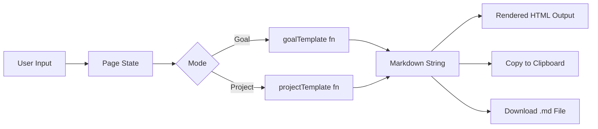

procee---
title: "Archer — Architecture Spine"
status: final
created: 2026-08-20
updated: 2026-08-20
altitude: initiative→features
scope: Archer MVP1 — full system
---

# Architecture Spine — Archer

## Paradigm

**Component-based SPA with static export.** A single-page React application compiled to static HTML/JS/CSS at build time. No server runtime, no API layer, no database. All logic executes client-side in the browser.

## Decisions

### AD-1: Component-Based SPA with Static Export [ADOPTED]

- **Binds:** All UI is React components; app ships as pre-rendered static files
- **Prevents:** Server-side runtime, API routes, dynamic server rendering
- **Rule:** No `getServerSideProps`, no route handlers, no middleware

### AD-2: Next.js 14+ App Router, Static Export [ADOPTED]

- **Binds:** File-based routing via `app/` directory; `output: 'export'` in `next.config.js`
- **Prevents:** Dynamic server features, ISR, server actions
- **Rule:** Single route (`app/page.tsx`). All components use `'use client'` directive.

### AD-3: Local Component State Only [ADOPTED]

- **Binds:** `useState` co-located in the page component manages mode, input text, and generated output
- **Prevents:** Global state libraries (Redux, Zustand, Jotai)
- **Rule:** No state management dependencies. State resets on page reload (acceptable — no persistence needed).

### AD-4: Template Engine as Pure Functions [ADOPTED]

- **Binds:** Template generation is a pure TypeScript function: `(input: string, mode: 'goal' | 'project') => string`
- **Prevents:** Runtime template libraries, network calls for generation, side effects in generation
- **Rule:** Templates live in `lib/templates/`. Each returns a markdown string. Deterministic and unit-testable.

### AD-5: Tailwind CSS, No Component Library [ADOPTED]

- **Binds:** All styling via Tailwind utility classes; design tokens from DESIGN.md encoded as Tailwind config extensions
- **Prevents:** CSS-in-JS, external UI kits (shadcn, Radix, MUI)
- **Rule:** Custom components in `components/`. Tailwind config extends with Archer's color/spacing/typography tokens.

### AD-6: Vercel Static Deployment [ADOPTED]

- **Binds:** Deploy target is Vercel free tier serving the `out/` directory
- **Prevents:** Serverless functions, edge runtime, environment variables
- **Rule:** `next build` produces a fully static `out/` folder. No build-time data fetching.

## Seed Structure

```
app/
├── layout.tsx          # HTML shell, Inter font, metadata
├── page.tsx            # Single page — all UI state lives here
├── globals.css         # Tailwind directives + custom tokens
components/
├── ModeToggle.tsx      # Goal/Project segmented control
├── InputSection.tsx    # Text input + generate button
├── OutputPanel.tsx     # Rendered HTML output + action bar
├── ActionBar.tsx       # Copy + Download buttons
├── ExampleButton.tsx   # "Try an example" trigger
lib/
├── templates/
│   ├── goal-template.ts    # Goal mode markdown generator
│   └── project-template.ts # Project mode markdown generator
├── utils/
│   ├── clipboard.ts        # Copy-to-clipboard with fallback
│   ├── download.ts         # File download trigger
│   └── slugify.ts          # Input → filename slug
tailwind.config.ts      # Extended with Archer design tokens
next.config.js          # output: 'export', static config
```

## Data Flow



## Boundary Rules

1. **Components** receive props and emit callbacks. No component calls template functions directly — the page orchestrates.
2. **Template functions** are pure: no DOM access, no React imports, no side effects. They live in `lib/` not `components/`.
3. **Browser APIs** (clipboard, download, scroll) are isolated in `lib/utils/` — components call these utilities, never the raw APIs.

## Deferred

- **AI generation layer** — future enhancement; the template function signature (`input → markdown`) is designed so an AI-backed implementation can slot in without changing the component layer.
- **Dark mode** — not in MVP1; Tailwind's dark mode support makes this a low-cost addition later.
- **i18n** — not in MVP1; template strings are English-only.
- **Testing strategy** — unit tests for template functions recommended but not mandated for MVP1.
- **SEO / Open Graph** — minimal metadata in layout; no dynamic OG images.
